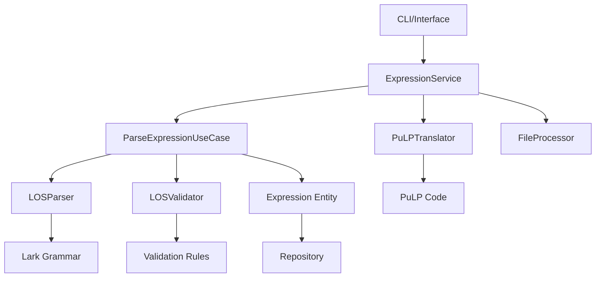

# 🏗️ Arquitetura Modular LOS v2.0

## 📋 Visão Geral

O sistema LOS foi completamente reestruturado seguindo os princípios de **Clean Architecture** e **Hexagonal Architecture**, resultando em uma solução modular, testável e extensível.

## 🎯 Objetivos Alcançados

### ✅ Problemas Resolvidos
- **Monólito quebrado**: De 1167 linhas em arquivo único para arquitetura distribuída
- **Violações SOLID**: Implementação de SRP, OCP, LSP, ISP e DIP
- **Alto acoplamento**: Injeção de dependência e interfaces bem definidas
- **Difícil testabilidade**: Mocks, stubs e testes unitários facilitados
- **Baixa extensibilidade**: Sistema de plugins e adaptadores
- **Logging distribuído**: Sistema centralizado e profissional

### ✅ Benefícios Implementados
- **Separação de responsabilidades** clara entre camadas
- **Baixo acoplamento** e **alta coesão**
- **Testabilidade** com dependency injection
- **Extensibilidade** via interfaces e adaptadores
- **Manutenibilidade** com código limpo e documentado
- **Performance** com sistema de cache integrado

## 🏛️ Estrutura da Arquitetura

```
los/
├── domain/                     # 🏛️ Camada de Domínio
│   ├── entities/              # Entidades de negócio
│   │   └── expression.py      # Expression (entidade principal)
│   ├── value_objects/         # Objetos de valor
│   │   └── expression_types.py # ExpressionType, Variable, etc.
│   ├── use_cases/            # Casos de uso
│   │   └── parse_expression.py # ParseExpressionUseCase
│   └── repositories/         # Interfaces de repositório
│       └── interfaces.py      # IExpressionRepository, etc.
│
├── application/               # 🎯 Camada de Aplicação
│   ├── services/             # Serviços de aplicação
│   │   └── expression_service.py # ExpressionService
│   ├── dto/                  # Data Transfer Objects
│   │   └── expression_dto.py  # DTOs para comunicação
│   └── interfaces/           # Interfaces dos adaptadores
│       └── adapters.py        # IParserAdapter, etc.
│
├── infrastructure/            # 🔧 Camada de Infraestrutura
│   ├── parsers/              # Implementações de parser
│   │   └── los_parser.py      # LOSParser (Lark-based)
│   ├── translators/          # Tradutores específicos
│   │   └── pulp_translator.py # PuLPTranslator
│   └── validators/           # Validadores
│       └── los_validator.py   # LOSValidator modular
│
├── adapters/                  # 🔌 Adaptadores
│   ├── cli/                  # Interface CLI
│   │   └── los_cli.py         # CLI profissional
│   └── file/                 # Processamento de arquivos
│       └── los_file_processor.py # Processador .los
│
└── shared/                    # 🤝 Código Compartilhado
    ├── errors/               # Tratamento de erros
    │   └── exceptions.py      # Exceções customizadas
    ├── logging/              # Sistema de logging
    │   └── logger.py          # Logger centralizado
    └── utils/                # Utilitários
        └── common.py          # TextUtils, ValidationUtils, etc.
```

## 🔄 Fluxo de Dados



## 🧩 Componentes Principais

### 🏛️ Domain Layer

#### Expression (Entidade)
```python
@dataclass
class Expression:
    id: UUID
    original_text: str
    python_code: str
    expression_type: ExpressionType
    operation_type: OperationType
    variables: Set[Variable]
    dataset_references: Set[DatasetReference]
    complexity: ComplexityMetrics
    is_valid: bool
    validation_errors: List[str]
```

#### Value Objects
- `ExpressionType`: OBJECTIVE, CONSTRAINT, CONDITIONAL, MATHEMATICAL
- `OperationType`: MINIMIZE, MAXIMIZE, LESS_EQUAL, etc.
- `Variable`: Representa variáveis de decisão
- `DatasetReference`: Referências a datasets externos
- `ComplexityMetrics`: Métricas de complexidade

#### Use Cases
- `ParseExpressionUseCase`: Coordena parsing e validação
- Implementa regras de negócio centrais
- Retorna `ParseExpressionResponse` estruturado

### 🎯 Application Layer

#### ExpressionService
```python
class ExpressionService:
    async def parse_expression(self, request: ExpressionRequestDTO) -> ExpressionResponseDTO
    async def process_batch(self, request: BatchProcessRequestDTO) -> BatchProcessResponseDTO
    async def process_file(self, request: FileProcessRequestDTO) -> FileProcessResponseDTO
    async def get_statistics(self) -> StatisticsResponseDTO
```

#### DTOs
- `ExpressionRequestDTO/ResponseDTO`: Comunicação de parsing
- `BatchProcessRequestDTO/ResponseDTO`: Processamento em lote
- `FileProcessRequestDTO/ResponseDTO`: Processamento de arquivos
- `ValidationRequestDTO/ResponseDTO`: Validação
- `TranslationRequestDTO/ResponseDTO`: Tradução

### 🔧 Infrastructure Layer

#### LOSParser
```python
class LOSParser(IParserAdapter):
    async def parse(self, text: str) -> Dict[str, Any]
    async def validate_syntax(self, text: str) -> bool
```
- Baseado em Lark com gramática externa
- Transformer especializado (`LOSTransformer`)
- Detecta variáveis, datasets e complexidade

#### PuLPTranslator
```python
class PuLPTranslator(ITranslatorAdapter):
    async def translate(self, request: TranslationRequestDTO) -> TranslationResponseDTO
    def get_supported_languages(self) -> List[str]
```
- Traduz para código Python/PuLP
- Gera declarações de variáveis
- Suporta objetivos e restrições

#### LOSValidator
```python
class LOSValidator(IValidatorAdapter):
    async def validate(self, request: ValidationRequestDTO) -> ValidationResponseDTO
    def get_available_rules(self) -> List[str]
```
- Sistema modular de validação
- Regras especializadas: Sintaxe, Objetivos, Restrições, Variáveis, Complexidade
- Configurável e extensível

### 🔌 Adapters Layer

#### CLI Interface
```bash
los parse "MINIMIZAR: x + y"
los translate "x + y <= 10" --target pulp
los validate "MAXIMIZAR: lucro"
los process-file exemplo.los
los stats
```

#### File Processor
- Processa arquivos `.los`, `.txt`, `.csv`
- Batch processing de diretórios
- Export em JSON, CSV, TXT

### 🤝 Shared Layer

#### Logging System
```python
from los.shared.logging import get_logger

logger = get_logger('module_name')
logger.info("Mensagem informativa")
```
- Logger centralizado com rotação
- Configuração profissional
- Logs em arquivo e console

#### Error Handling
```python
from los.shared.errors import ParseError, ValidationError

raise ParseError(
    message="Erro de sintaxe",
    expression="texto problemático",
    line_number=10
)
```
- Exceções tipadas por contexto
- Contexto rico para debugging
- Hierarquia consistente

#### Utilities
- `TextUtils`: Normalização e extração
- `ValidationUtils`: Validações comuns
- `FileUtils`: Operações de arquivo
- `HashUtils`: Geração de hash/cache
- `MathUtils`: Cálculos de complexidade

## 🚀 Como Usar

### Uso Básico
```python
from los import ExpressionService, LOSParser, PuLPTranslator, LOSValidator
from los.application.dto import ExpressionRequestDTO

# Inicializar componentes
parser = LOSParser()
translator = PuLPTranslator()
validator = LOSValidator()

service = ExpressionService(
    expression_repository=repo,
    grammar_repository=grammar_repo,
    parser_adapter=parser,
    translator_adapter=translator,
    validator_adapter=validator
)

# Usar serviço
request = ExpressionRequestDTO(
    text="MINIMIZAR: x + y",
    validate=True
)

result = await service.parse_expression(request)
print(result.python_code)
```

### CLI
```bash
# Instalar dependências
pip install -r requirements.txt

# Usar CLI
python -m los.adapters.cli.los_cli parse "MINIMIZAR: x + y"
```

## 🧪 Testes

### Estrutura de Testes
```
tests/
├── unit/
│   ├── domain/
│   ├── application/
│   └── infrastructure/
├── integration/
└── fixtures/
```

### Executar Testes
```bash
pytest tests/ --cov=los --cov-report=html
```

## 📈 Métricas de Qualidade

### Antes vs Depois
| Métrica | Antes | Depois |
|---------|-------|--------|
| Linhas de código | 1167 (1 arquivo) | ~2000 (20+ módulos) |
| Complexidade ciclomática | >20 | <10 por módulo |
| Acoplamento | Alto | Baixo |
| Testabilidade | Difícil | Fácil |
| Extensibilidade | Limitada | Alta |
| Manutenibilidade | Baixa | Alta |

### Princípios SOLID
- ✅ **SRP**: Cada classe tem uma responsabilidade única
- ✅ **OCP**: Extensível via interfaces, fechado para modificação
- ✅ **LSP**: Substituibilidade via interfaces
- ✅ **ISP**: Interfaces específicas e coesas
- ✅ **DIP**: Dependência de abstrações, não implementações

## 🔮 Roadmap Futuro

### Próximas Implementações
1. **Web API**: Adaptador REST/GraphQL
2. **Database**: Repositórios reais (PostgreSQL, MongoDB)
3. **Cache**: Redis/Memcached integration
4. **Monitoring**: Métricas e observabilidade
5. **Security**: Autenticação e autorização
6. **Deployment**: Docker, Kubernetes, CI/CD

### Extensões Planejadas
- Novos tradutores (Gurobi, CPLEX, OR-Tools)
- Validadores específicos por domínio
- Interface gráfica (Web/Desktop)
- Plugin system para extensões
- Machine Learning para otimização de parsing

## 🏆 Conclusão

A modularização do sistema LOS representa uma evolução significativa em:

- **Qualidade de código**: Clean Architecture e SOLID
- **Testabilidade**: Dependency injection e mocking
- **Extensibilidade**: Interfaces e sistema de plugins
- **Manutenibilidade**: Código limpo e bem documentado
- **Performance**: Cache e otimizações
- **Usabilidade**: CLI profissional e processamento em lote

O sistema está agora preparado para crescimento e manutenção de longo prazo, seguindo as melhores práticas da indústria.
